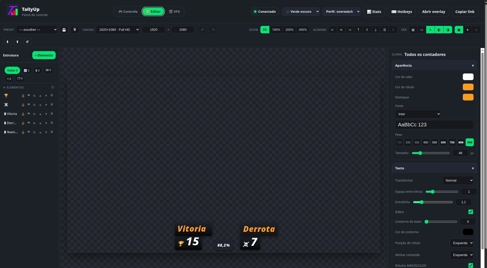
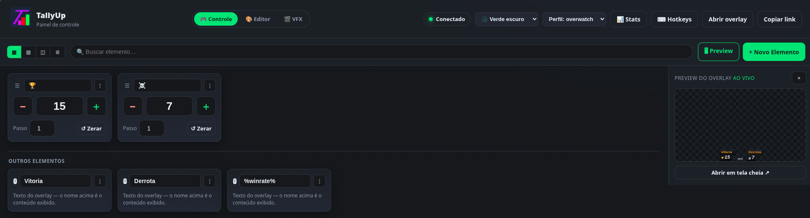
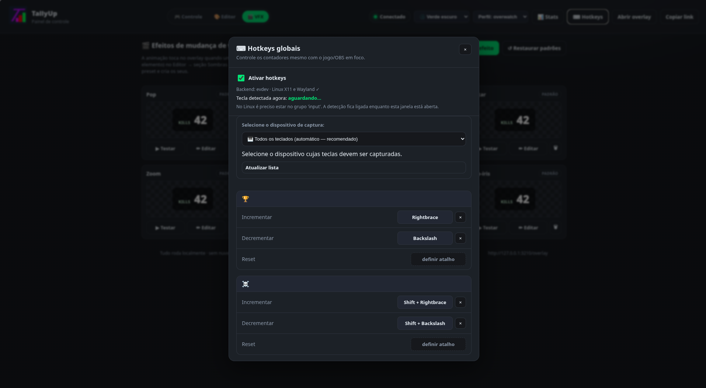
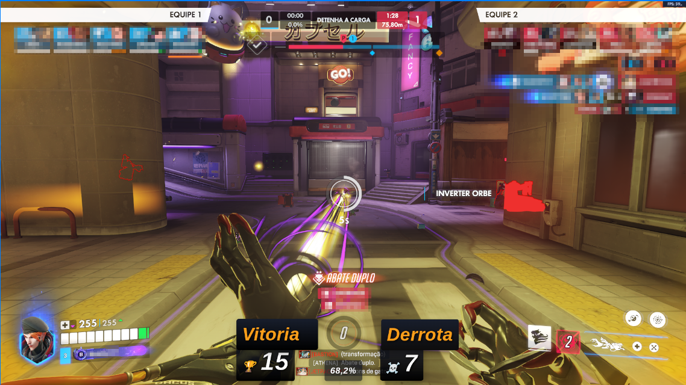
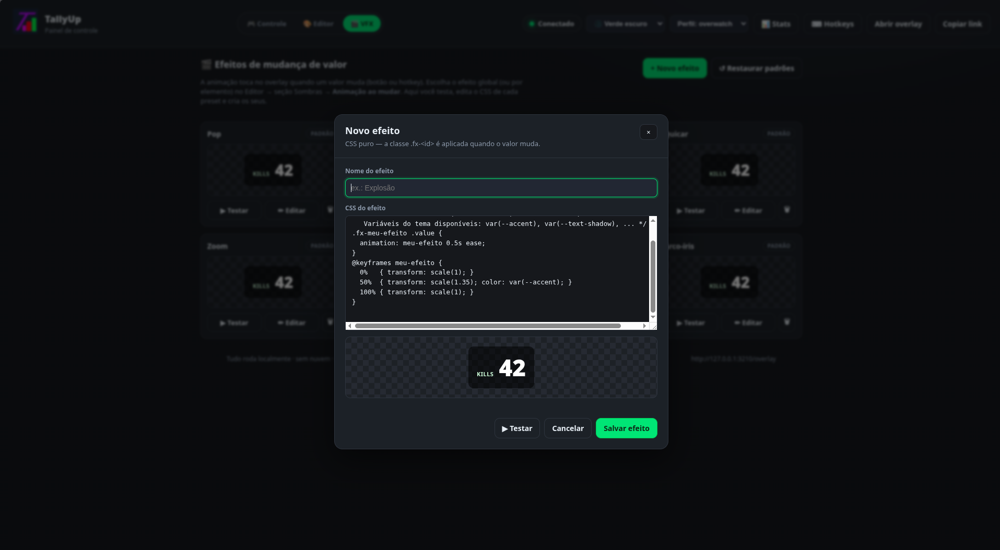
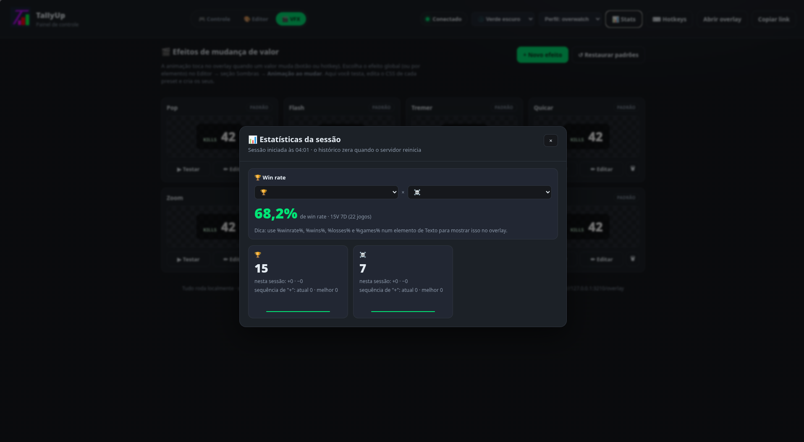

# TallyUp

<p align="center">
  
</p>

[🇧🇷 Português](README.md) · 🇺🇸 English

**Live tally overlay for OBS.** Counters, timers, free text and images on your
stream, with a visual editor, global hotkeys and per-game profiles. Runs 100%
on `localhost` — no cloud, no database, no login.

> Perfect for streams: deaths, wins, bosses defeated, speedrun attempts,
> challenge timers, kills, and more.

## 📸 Screenshots

<p align="center">
  
  
  
  <br />
  
  
  
</p>

---

## ✨ What's included

- Unlimited counters with custom name and step
- Increment, decrement, reset, edit value and name
- Hide/show, delete and reorder (move up/down)
- **Control dashboard** with 4 view modes (Cards, Table, Grid, List), search,
  action menu (⋮), drag to reorder and a **live overlay preview** on the side
- **Control ↔ Editor bridge**: jump from a counter to edit its look
  (and back to controlling values) without losing context
- Transparent-background overlay for OBS
- **Real-time updates** via WebSocket (no F5 needed)
- Automatic persistence in human-readable JSON files
- Atomic writes + automatic backup (`.bak`) — data never gets corrupted
- **Visual canvas editor** (Editor tab), Figma/OBS style:
  - 3 columns: **Structure** (element tree) · **Canvas** · **Properties**
  - **drag to position**, selection handles and resizing; X/Y/size inspector
  - tree with select, **hide, lock, duplicate** and reorder
  - **per-element style** (each with its own color/font/size/position)
  - **17 presets** (OBS Dark, Minimal, Cyberpunk, Arcade, Pixel, Retro,
    Streamer, Speedrun, Neon, Transparent, Glass, Terminal, Overwatch,
    Dark Souls, Valorant, League of Legends, Minecraft)
  - advanced **color picker** (SV + hue + opacity + HEX/RGB + recents)
  - typography (letter spacing, line height, transform, italic, text stroke)
  - **undo/redo** (Ctrl+Z / Ctrl+Shift+Z), zoom (Fit/100/200/400), grid,
    safe area and snap

Phase 2 is done as well: **global hotkeys** (Windows/X11/Wayland),
**profiles** (independent sets of counters/theme/hotkeys, with a switcher in
the panel) and **automatic backups**. See the **Roadmap** at the end and
**TODO.md**.

---

## 🚀 Install & run

Requires **Python 3.12+** (works from 3.10).

### Windows
Double-click **`start.bat`**.
It creates the environment, installs everything and opens the browser.

### Linux / macOS
```bash
chmod +x start.sh
./start.sh
```

### Manual (any OS)
```bash
python -m venv .venv
# Windows: .venv\Scripts\activate    |    Linux/macOS: source .venv/bin/activate
pip install -r requirements.txt
python server.py
```

Once running, open:

| Page    | Address                           |
|---------|-----------------------------------|
| Panel   | http://127.0.0.1:3210/admin       |
| Overlay | http://127.0.0.1:3210/overlay     |

---

## 🎥 Adding it to OBS

1. In OBS: **Sources → Add → Browser**.
2. In **URL**, paste: `http://127.0.0.1:3210/overlay`
3. Set the **Width and Height to match the canvas** configured in the Editor
   (default 1920×1080; change it in the "Canvas" toolbar selector — presets
   from 720p to 4K, vertical and square). If the source has a different size,
   the canvas scales proportionally.
4. Confirm. The background is transparent — only your elements show up.
5. Control and position everything from the **Panel** (`/admin`) in another
   window/tab — the overlay updates by itself, in real time.

> Tip: the panel has a **"Copy link"** button for the overlay URL.

---

## 🗂️ Project layout

```
WinRate/
├── server.py            # FastAPI server (REST + WebSocket)
├── requirements.txt
├── clean.py             # wipes personal data (see Cleanup)
├── start.bat / start.sh # launchers
├── config/              # saved data (JSON)
│   ├── config.json
│   ├── counters.json
│   ├── theme.json
│   └── hotkeys.json
├── backend/             # Python modules
│   ├── storage.py       # atomic JSON + backup
│   ├── config.py        # app settings
│   ├── counter.py       # element CRUD (counters, text, images, timers)
│   ├── themes.py        # overlay theme
│   ├── websocket.py     # real-time broadcast
│   ├── profiles.py      # profiles + game templates
│   ├── backup.py        # automatic backups
│   └── hotkeys.py       # global hotkeys
├── admin/               # panel (HTML/CSS/JS)
├── overlay/             # overlay (HTML/CSS/JS)
└── assets/              # themes, fonts, icons, uploads
```

---

## 🔌 REST API

Base: `http://127.0.0.1:3210`

**Read (GET)**

| Route       | Description                  |
|-------------|------------------------------|
| `/counters` | list all elements            |
| `/config`   | app settings                 |
| `/theme`    | current theme                |
| `/stats`    | session event history        |
| `/health`   | server status                |

**Actions (POST, JSON body)**

| Route                  | Body                                   |
|------------------------|----------------------------------------|
| `/counter/create`      | `{ "name": "Deaths", "step": 1, "type": "counter" }` (types: counter, text, image, timer) |
| `/counter/inc`         | `{ "id": "..." }`                      |
| `/counter/dec`         | `{ "id": "..." }`                      |
| `/counter/set`         | `{ "id": "...", "value": 10 }`         |
| `/counter/reset`       | `{ "id": "..." }`                      |
| `/counter/rename`      | `{ "id": "...", "name": "Wins" }`      |
| `/counter/step`        | `{ "id": "...", "step": 5 }`           |
| `/counter/visibility`  | `{ "id": "..." }` (toggles)            |
| `/counter/move`        | `{ "id": "...", "direction": "up" }`   |
| `/counter/reorder`     | `{ "order": ["id1", "id2", ...] }`     |
| `/counter/style`       | `{ "id": "...", "style": {...} }`      |
| `/counter/position`    | `{ "id": "...", "x": 300, "y": 220 }`  |
| `/counter/lock`        | `{ "id": "...", "locked": true }`      |
| `/counter/duplicate`   | `{ "id": "..." }`                      |
| `/counter/delete`      | `{ "id": "..." }`                      |
| `/counter/type`        | `{ "id": "...", "type": "timer" }` (convert element) |
| `/counter/timer`       | `{ "id": "...", "op": "toggle" }` (start/pause/toggle/reset) |
| `/counter/src`         | `{ "id": "...", "src": "/assets/uploads/x.png" }` (image) |
| `/assets/upload`       | multipart image upload (png/jpg/gif/webp/svg, 10 MB max) |
| `/theme`               | object with theme fields               |
| `/hotkeys`             | `{ "enabled": true }` (on/off)         |
| `/hotkeys/binding`     | `{ "id": "...", "action": "inc", "keys": "ctrl+f1" }` |
| `/profiles/create`     | `{ "name": "Dark Souls", "template": "darksouls" }` (no template: copies the active one) |
| `/profiles/switch`     | `{ "name": "dark-souls" }`             |
| `/profiles/delete`     | `{ "name": "dark-souls" }` (can't be the active one) |

`GET /profiles` lists profiles and the active one; `GET /profiles/templates`
lists ready-made game templates — **Overwatch** (Wins/Losses/Draws), **Dark
Souls** (Deaths/Bosses), **Valorant**, **League of Legends**, **Minecraft**
and **Speedrun** — each with matching counters and theme. Every profile has
its own counters, theme and hotkeys (`config/profiles/<slug>/`); "default"
uses `config/` directly.

> **Security:** the server only accepts POSTs and WebSocket connections from a
> local origin. Requests without an `Origin` header (curl, OBS, scripts) are
> allowed. Full automatic backups live in `config/backups/` (10 most recent).

Value actions (`inc`/`dec`/`reset`/`set`) and hotkeys go through the same
**Action Manager** — a single point that applies the change, saves the JSON
and notifies the WebSocket. Buttons, shortcuts and future integrations share
the same logic.

**Real time:** WebSocket at `ws://127.0.0.1:3210/ws`. On connect the server
sends `{"type":"init", counters, theme, hotkeys, profiles}`; on every change
it sends `{"type":"counters", data}`, `{"type":"theme", data}`, etc.

---

## 🎛️ Control screen (dashboard)

The **Control** tab is where you operate during the stream:

- **4 view modes** at the top: **Cards** (default), **Table** (compact, great
  for dozens of counters), **Grid** and **List**.
- **Search** 🔍 to find an element quickly.
- **+ New Element** creates a counter, free text, image or timer instantly.
- Each counter: `-` / `+`, edit name and value, **Reset**, and the **⋮** menu
  (edit appearance, duplicate, hide, move up/down, delete). Timers get
  **▶/⏸/↺** and text/images live in the "Other elements" section.
- **Drag** the ☰ handle to reorder.
- **Live overlay preview** on the right (collapsible).
- Footer shows **Auto-save ✓** with the time of the last change.

And the **Editor bridge**: in an element's ⋮ menu, *Edit appearance* opens it
already selected in the Editor; the Editor has **▸ Control** to jump back.

---

## 🎨 Visual editor (canvas)

Open the panel and click the **Editor** tab. It's a live canvas editor — the
overlay changes instantly, no save button:

- **Structure** (left): element tree with **type tabs** (🔢 🅣 🖼 ⏱). Select
  (Shift = multi-select), **hide**, **lock**, **duplicate** and reorder.
  `+ Element` creates a counter, **free text**, **image** or **timer**.
- **Canvas** (center, configurable size from 720p to 4K/vertical): **drag to
  move** (with Photoshop-style **smart guides**), handles to resize, **arrow
  keys** (Shift = 10px), **align/distribute** toolbar. Zoom
  **Fit/100/200/400**, checker/black/white background, **grid**, **safe
  area** and **snap**. Side panels are resizable and collapsible.
- **Properties** (right): contextual.
  - No selection → **Global** (applies to all): appearance, typography, card
    and shadows.
  - With an element → **Element**: **Type** (convertible), **Transform**
    (X, Y, size, lock, duplicate, delete) + its own style overrides.
    "Restore" goes back to global.
- **17 presets** at the top — apply and tweak.
- Advanced style: background **gradient**, opacity, rotation, fixed card
  width, **text stroke**, label position and content alignment.
- **Undo/Redo**: `Ctrl+Z` / `Ctrl+Shift+Z` (theme, styles and positions).
- **Export / Import** theme (`theme.json`).
- **Panel themes**: 6 variations (green/purple/red × dark/light) in the topbar.

Prefer editing by hand? `config/theme.json` is still valid, and every element
has `x`, `y` and a `style` field with its visual overrides.

---

## ⌨ Global hotkeys

Control your counters with shortcuts **even while the game or OBS is focused**.

1. In the panel, click **⌨ Hotkeys** (top).
2. Turn on **Enable hotkeys**.
3. For each counter, click *set shortcut* on **Increment**, **Decrement** or
   **Reset** and **press the combination** (e.g. `Ctrl+F1`). If the key is
   taken, the panel warns you and offers to replace it. While the window is
   open, the **"Key detected now"** line shows what the system is reading.

**Two backends, chosen automatically:**

- **Windows / macOS:** `pynput` (global hook).
- **Linux (X11 and Wayland):** `evdev`, reading `/dev/input` straight from the
  kernel — that's why it **works on Wayland**. Your user must be in the
  `input` group:

  ```bash
  sudo usermod -aG input $USER   # then log out and back in
  ```

Shortcuts use the **physical key** (layout/Shift independent). For timers, the
*Increment* shortcut becomes **Start/Pause** and *Reset* **zeroes** it. The
server must be running. In `config/hotkeys.json`:

```json
{ "enabled": true,
  "bindings": { "<element-id>": { "inc": "ctrl+f1", "dec": "ctrl+equal", "reset": "ctrl+f3" } } }
```

---

## 🎬 VFX — value-change effects

The **🎬 VFX** tab holds the library of animations that play on the overlay
whenever a value changes: **8 built-in effects** (Pop, Flash, Shake, Bounce,
Zoom, Slide, Glow, Rainbow) with animated previews — click the stage to test.
Every preset is **editable pure CSS** (✏ Edit), and **+ New effect** creates
your own from a commented template: the `.fx-<id>` class is applied to the
element on change, with theme variables (`var(--accent)` etc.) available.
"↺ Restore defaults" brings back the originals without deleting yours.

Pick the active effect in **Editor → Shadows → Change animation** — globally
or per element (one counter can shake while another glows). API:
`GET /effects`, `POST /effects/save|delete|reset`.

---

## 📊 Statistics

The **📊 Stats** button at the top of the panel shows, per session: **win rate
(%)** — pick which counters mean wins and losses (saved per profile) —, a
sparkline of each counter, session `+`/`−` totals and the current/best
**"+" streak**. History resets when the server restarts (`GET /stats` exposes
the events).

**Overlay macros:** in a **free text** element, write `%winrate%`, `%wins%`,
`%losses%` or `%games%` — the overlay replaces them with live values (e.g.
`WR: %winrate% (%wins%W %losses%L)` → `WR: 66.7% (10W 5L)`). The W/L counters
are the ones set in 📊 Stats; without a selection, the app guesses by name
(Wins/Vitórias, Losses/Derrotas).

---

## 🧹 Cleanup / publishing

`python clean.py` wipes **your data** (counters, profiles, theme, hotkeys,
backups, uploads, logs and caches), leaving the project factory-fresh —
defaults are recreated on the next run. Use `--dry-run` to only list and
`--yes` to skip confirmation. `.gitignore` already keeps `config/` and
`assets/uploads/` out of version control.

---

## 🧪 Tests

```bash
pip install -r requirements-dev.txt
pytest
```

Tests run with `config/` isolated in a temporary directory — they never touch
your real data. They cover: atomic storage, hotkey combo normalization,
counters (CRUD/order/debounce), profiles and templates, backups, theme,
element types (text/image/timer) and the API (including the origin guard and
the WebSocket).

---

## 🐞 Debug mode (hotkey diagnostics)

If a shortcut doesn't fire, run in debug mode — it turns the **key monitor**
on from the start and logs every detected key to `hotkeys.log`:

```bash
./start.sh --debug        # Linux/macOS
start.bat --debug         # Windows
python server.py --debug  # manual (or TALLYUP_DEBUG=1 python server.py)
```

In the log look for `MATCH:` (shortcut matched and fired) or `tecla detectada`
(capture works). ⚠ In debug mode the log records **everything** you type on the
system — use it only for debugging and switch back to normal mode afterwards.

---

## 🧯 Troubleshooting

- **Port 3210 in use:** change `"port"` in `config/config.json`.
- **Browser didn't open:** go to `http://127.0.0.1:3210/admin` manually.
- **Overlay shows a black background in OBS:** make sure it's a **Browser
  Source** pointing to `/overlay` (the background is transparent by default).

---

## 🗺️ Roadmap

- **Phase 1 — MVP ✅** counters, panel, overlay, JSON, WebSocket
- **Phase 1.5 ✅** visual canvas editor + control dashboard
- **Phase 2 ✅** Action Manager · global hotkeys Win/X11/**Wayland** · **profiles** · **automatic backups**
- **Phase 3** theme system (user presets), fonts and icons
- **Phase 4 ✅** full editor: multi-select, align/distribute, smart guides, configurable canvas, panel themes and **new elements** (free text, image, timer)
- **Phase 5** plugins, sounds, GIFs, integrations (Twitch/Kick/YouTube/Stream Deck)

Detailed tasks per phase: see **[TODO.md](TODO.md)** (in Portuguese).

---

## 🧩 Philosophy

No database. No heavy frontend dependencies. Everything configurable from the
browser. Human-readable JSON. Modular, maintainable code. Performance over
looks.
