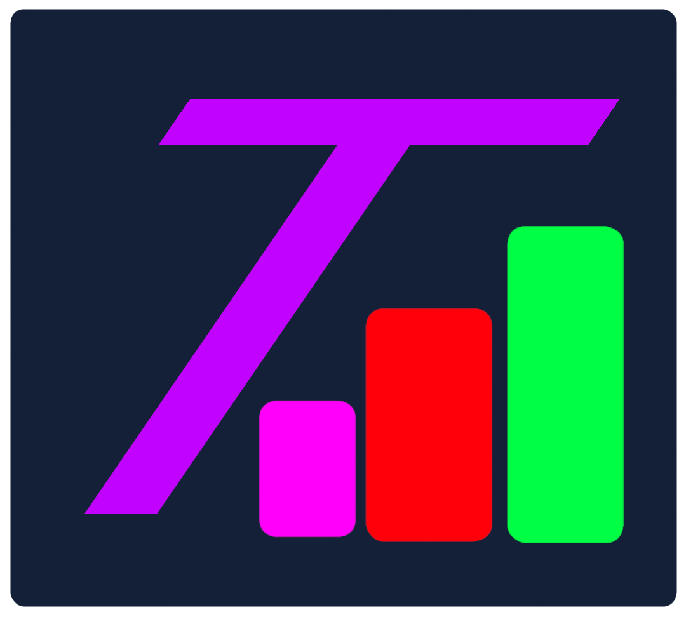

# TallyUp

<p align="center">
  
</p>

🇧🇷 Português · [🇺🇸 English](README.en.md)

**Overlay de contagem ao vivo para OBS.** Contadores, timers, textos e imagens na sua transmissão, com editor visual, hotkeys globais e perfis por jogo. Roda 100% em `localhost` — sem nuvem, sem banco de dados, sem login.

> Ideal para lives: mortes, vitórias, chefes derrotados, tentativas de speedrun, cronômetro de desafio, kills, etc.

---

## ✨ O que já funciona (Fase 1 — MVP)

- Contadores ilimitados, com nome e passo personalizáveis
- Incrementar, decrementar, zerar, editar valor e nome
- Ocultar/mostrar, excluir e reordenar (mover para cima/baixo)
- **Dashboard de Controle** com 4 modos de visualização (Cards, Tabela, Grade,
  Lista), busca, menu de ações (⋮), arrastar para reordenar e **preview do
  overlay ao vivo** ao lado
- **Ponte Controle ↔ Editor**: pule de um contador para editar a aparência dele
  (e volte para controlar os valores) sem perder o contexto
- Overlay de fundo transparente para o OBS
- **Atualização em tempo real** via WebSocket (sem apertar F5)
- Persistência automática em arquivos JSON legíveis
- Escrita atômica + backup automático (`.bak`) — não corrompe dados
- **Editor visual de canvas** (aba Editor) estilo Figma/OBS:
  - 3 colunas: **Estrutura** (árvore de elementos) · **Canvas 1920×1080** · **Propriedades**
  - **arrastar para posicionar**, alças de seleção e redimensionar; inspetor X/Y/tamanho
  - árvore com selecionar, **ocultar, bloquear, duplicar** e reordenar
  - **estilo por contador** (cada um com cor/fonte/tamanho/posição próprios)
  - **17 presets** (OBS Dark, Minimal, Cyberpunk, Arcade, Pixel, Retro, Streamer, Speedrun, Neon, Transparent, Glass, Terminal + Overwatch, Dark Souls, Valorant, LoL, Minecraft)
  - **color picker** avançado (SV + matiz + opacidade + HEX/RGB + recentes)
  - tipografia (espaçamento, entrelinha, transformar, itálico)
  - **desfazer/refazer** (Ctrl+Z / Ctrl+Shift+Z), zoom (Fit/100/200/400), grid, área segura e snap

A Fase 2 também está pronta: **hotkeys globais** (Windows/X11/Wayland),
**perfis** (conjuntos independentes de contadores/tema/atalhos, com seletor no
painel) e **backup automático**. Veja o **Roadmap** no fim e o **TODO.md**.

---

## 🚀 Instalação e uso

Requer **Python 3.12+** (funciona a partir do 3.10).

### Windows
Dê dois cliques em **`start.bat`**.
Ele cria o ambiente, instala tudo e abre o navegador sozinho.

### Linux / macOS
```bash
chmod +x start.sh
./start.sh
```

### Manual (qualquer sistema)
```bash
python -m venv .venv
# Windows: .venv\Scripts\activate    |    Linux/macOS: source .venv/bin/activate
pip install -r requirements.txt
python server.py
```

Ao iniciar, abra:

| Página  | Endereço                          |
|---------|-----------------------------------|
| Painel  | http://127.0.0.1:3210/admin       |
| Overlay | http://127.0.0.1:3210/overlay     |

---

## 🎥 Como adicionar no OBS

1. No OBS: **Fontes → Adicionar → Navegador**.
2. Em **URL**, cole: `http://127.0.0.1:3210/overlay`
3. Defina a **Largura e Altura iguais ao canvas** configurado no Editor
   (padrão 1920×1080; mude no seletor "Canvas" da toolbar — há presets de
   720p a 4K, vertical e quadrado). Se a fonte tiver outro tamanho, o canvas
   é escalado proporcionalmente.
4. Confirme. O fundo é transparente — só os contadores aparecem.
5. Controle e posicione tudo pelo **Painel** (`/admin`) em outra janela/aba —
   o overlay atualiza sozinho, em tempo real.

> Dica: no painel há o botão **“Copiar link”** do overlay. Se a sua fonte não
> for 1920×1080, o canvas é escalado proporcionalmente para caber.

---

## 🗂️ Estrutura do projeto

```
WinRate/
├── server.py            # servidor FastAPI (REST + WebSocket)
├── requirements.txt
├── start.bat / start.sh # inicializadores
├── config/              # dados salvos (JSON)
│   ├── config.json
│   ├── counters.json
│   ├── theme.json
│   └── hotkeys.json
├── backend/             # módulos Python
│   ├── storage.py       # JSON atômico + backup
│   ├── config.py        # configurações do app
│   ├── counter.py       # CRUD dos contadores
│   ├── themes.py        # tema do overlay
│   ├── websocket.py     # broadcast em tempo real
│   ├── profiles.py      # perfis (Fase 2)
│   ├── backup.py        # backup automático (Fase 2)
│   └── hotkeys.py       # atalhos globais (Fase 2)
├── admin/               # painel (HTML/CSS/JS)
├── overlay/             # overlay (HTML/CSS/JS)
└── assets/              # temas, fontes, ícones, animações
```

---

## 🔌 API (REST)

Base: `http://127.0.0.1:3210`

**Leitura (GET)**

| Rota        | Descrição                    |
|-------------|------------------------------|
| `/counters` | lista os elementos           |
| `/config`   | configurações do app         |
| `/theme`    | tema atual                   |
| `/stats`    | eventos da sessão            |
| `/health`   | status do servidor           |

**Ações (POST, corpo em JSON)**

| Rota                   | Corpo                                  |
|------------------------|----------------------------------------|
| `/counter/create`      | `{ "name": "Mortes", "step": 1 }`      |
| `/counter/inc`         | `{ "id": "..." }`                      |
| `/counter/dec`         | `{ "id": "..." }`                      |
| `/counter/set`         | `{ "id": "...", "value": 10 }`         |
| `/counter/reset`       | `{ "id": "..." }`                      |
| `/counter/rename`      | `{ "id": "...", "name": "Vitórias" }`  |
| `/counter/step`        | `{ "id": "...", "step": 5 }`           |
| `/counter/visibility`  | `{ "id": "..." }` (alterna)            |
| `/counter/move`        | `{ "id": "...", "direction": "up" }`   |
| `/counter/reorder`     | `{ "order": ["id1", "id2", ...] }`     |
| `/counter/style`       | `{ "id": "...", "style": {...} }`      |
| `/counter/position`    | `{ "id": "...", "x": 300, "y": 220 }`  |
| `/counter/lock`        | `{ "id": "...", "locked": true }`      |
| `/counter/duplicate`   | `{ "id": "..." }`                      |
| `/counter/delete`      | `{ "id": "..." }`                      |
| `/counter/type`        | `{ "id": "...", "type": "timer" }` (converte o elemento) |
| `/counter/timer`       | `{ "id": "...", "op": "toggle" }` (start/pause/toggle/reset) |
| `/counter/src`         | `{ "id": "...", "src": "/assets/uploads/x.png" }` (imagem) |
| `/assets/upload`       | upload multipart de imagem (png/jpg/gif/webp/svg, máx. 10 MB) |
| `/theme`               | objeto com campos do tema              |
| `/hotkeys`             | `{ "enabled": true }` (liga/desliga)   |
| `/hotkeys/binding`     | `{ "id": "...", "action": "inc", "keys": "ctrl+f1" }` |
| `/profiles/create`     | `{ "name": "Dark Souls", "template": "darksouls" }` (sem template: copia o ativo) |
| `/profiles/switch`     | `{ "name": "dark-souls" }`             |
| `/profiles/delete`     | `{ "name": "dark-souls" }` (não pode ser o ativo) |

`GET /profiles` lista os perfis e o ativo; `GET /profiles/templates` lista os
templates prontos de jogos — **Overwatch** (Vitórias/Derrotas/Empates), **Dark
Souls** (Mortes/Bosses), **Valorant**, **League of Legends**, **Minecraft** e
**Speedrun** — cada um com contadores e tema combinando. Cada perfil tem
contadores, tema e hotkeys próprios (`config/profiles/<slug>/`); o "default"
usa `config/` direto.

> **Segurança:** o servidor só aceita POSTs e conexões WebSocket de origem
> local. Requisições sem header `Origin` (curl, OBS, scripts) são permitidas.
> Backups automáticos completos ficam em `config/backups/` (10 mais recentes).

As ações de valor (`inc`/`dec`/`reset`/`set`) e as hotkeys passam pelo mesmo
**Action Manager** — um ponto único que aplica a mudança, salva o JSON e notifica
o WebSocket. Assim botões, atalhos e integrações futuras usam a mesma lógica.

**Tempo real:** WebSocket em `ws://127.0.0.1:3210/ws`. Ao conectar, o servidor
envia `{"type":"init", counters, theme}`; a cada mudança, envia
`{"type":"counters", data}` ou `{"type":"theme", data}`.

---

## 🎛️ Tela de Controle (dashboard)

A aba **Controle** é onde você opera durante a live. Ela se adapta ao seu gosto:

- **4 modos** de visualização no canto superior: **Cards** (padrão), **Tabela**
  (compacta, ideal pra dezenas de contadores), **Grade** e **Lista**.
- **Busca** 🔍 para achar um elemento rápido quando há muitos.
- **+ Novo Elemento** cria contador, texto, imagem ou timer na hora.
- Em cada contador: `-` / `+`, editar nome e valor, **Zerar**, e o menu **⋮**
  (editar aparência, duplicar, ocultar, subir/descer, excluir). Timers têm
  **▶/⏸/↺** e textos/imagens aparecem na seção "Outros elementos".
- **Arraste** pelo ☰ para reordenar.
- **Preview do overlay ao vivo** à direita (recolhível) — veja como está ficando
  enquanto controla os valores.
- Rodapé mostra **Auto-save ✓** com o horário da última alteração.

E a **ponte com o Editor**: no menu ⋮ de um contador, *Editar aparência* abre
aquele contador já selecionado no Editor; e no Editor há **▸ Controlar** para
voltar direto a ele aqui.

---

## 🎨 Editor visual (canvas)

Abra o painel e clique na aba **Editor**. É um editor gráfico de canvas, ao vivo
— o overlay muda na hora, sem botão de salvar:

- **Estrutura** (esquerda): árvore de elementos com **tabs por tipo** (🔢 🅣 🖼 ⏱).
  Selecione (Shift = múltiplos), **oculte**, **bloqueie**, **duplique** e
  reordene. `+ Elemento` cria contador, **texto livre**, **imagem** ou **timer**.
- **Canvas** (centro, tamanho configurável de 720p a 4K/vertical): **arraste
  para mover** (com **guias inteligentes** estilo Photoshop), alças para
  redimensionar, **setas do teclado** (Shift = 10px), barra de
  **alinhar/distribuir**. Zoom **Fit/100/200/400**, fundo xadrez/preto/branco,
  **grade**, **área segura** e **snap**. Painéis laterais redimensionáveis
  e ocultáveis.
- **Propriedades** (direita): mudam conforme a seleção.
  - Sem seleção → **Global** (vale para todos): aparência, texto/tipografia,
    card e sombras.
  - Com um contador → **Elemento**: **Transformar** (X, Y, tamanho, bloquear,
    duplicar, excluir) + estilo **só dele**. "Restaurar" volta ao global.
- **12 presets** no topo (OBS Dark, Minimal, Cyberpunk, Arcade, Pixel, Retro,
  Streamer, Speedrun, Neon, Transparent, Glass, Terminal) — aplique e ajuste.
- **Color picker**: saturação/valor, matiz, opacidade, HEX/RGB e recentes.
- **Desfazer/Refazer**: `Ctrl+Z` / `Ctrl+Shift+Z` (tema, estilos e posições).
- **Exportar / Importar** tema (`theme.json`).

Preferir editar à mão? O `config/theme.json` continua válido, e cada contador
tem `x`, `y` e um campo `style` com os overrides visuais dele.

---

## ⌨ Hotkeys globais (Fase 2)

Controle os contadores com atalhos **mesmo com o jogo ou o OBS em foco**.

1. No painel, clique em **⌨ Hotkeys** (topo).
2. Ligue **Ativar hotkeys**.
3. Para cada contador, clique em *definir atalho* em **Incrementar**,
   **Decrementar** ou **Reset** e **pressione a combinação** (ex.: `Ctrl+F1`).
   Se a tecla já estiver em uso, o painel avisa e pergunta se quer substituir.
   Enquanto a janela está aberta, a linha **“Tecla detectada agora”** mostra o
   que o sistema está lendo — útil pra conferir que está funcionando.

**Dois backends, escolhidos automaticamente:**

- **Windows / macOS:** `pynput` (hook global).
- **Linux (X11 e Wayland):** `evdev`, lendo `/dev/input` direto do kernel — por
  isso **funciona no Wayland**. Requer que seu usuário esteja no grupo `input`:

  ```bash
  sudo usermod -aG input $USER   # depois refaça login
  ```

Os atalhos usam a **tecla física** (independente de layout/Shift). Em timers,
o atalho de *Incrementar* vira **Iniciar/Pausar** e o de *Reset* **zera**. O
servidor precisa estar rodando. Em `config/hotkeys.json`:

```json
{ "enabled": true,
  "bindings": { "<id-do-contador>": { "inc": "ctrl+f1", "dec": "ctrl+equal", "reset": "ctrl+f3" } } }
```

---

## 🎬 VFX — efeitos de mudança de valor

A aba **🎬 VFX** do painel traz a biblioteca de animações que tocam no overlay
quando um valor muda: **8 efeitos prontos** (Pop, Flash, Tremer, Quicar, Zoom,
Deslizar, Brilho, Arco-íris) com preview animado — clique no palco para
testar. Cada preset é **CSS puro editável** (✏ Editar), e **+ Novo efeito**
cria o seu a partir de um template comentado: a classe `.fx-<id>` é aplicada
ao elemento na mudança, com as variáveis do tema (`var(--accent)` etc.)
disponíveis. "↺ Restaurar padrões" recupera os efeitos originais sem apagar
os seus.

O efeito ativo é escolhido no **Editor → Sombras → Animação ao mudar** —
global ou por elemento (um contador pode tremer enquanto outro brilha). API:
`GET /effects`, `POST /effects/save|delete|reset`.

---

## 📊 Estatísticas

O botão **📊 Stats** no topo do painel mostra, por sessão: **win rate (%)** —
escolha quais contadores representam vitórias e derrotas (fica salvo no perfil)
—, gráfico da evolução de cada contador, total de `+`/`−` e a **sequência de
"+"** atual e a melhor. O histórico zera quando o servidor reinicia
(`GET /stats` expõe os eventos).

**Macros no overlay:** num elemento de **Texto livre**, escreva `%winrate%`,
`%wins%`, `%losses%` ou `%games%` — o overlay substitui pelos valores ao vivo
(ex.: `WR: %winrate% (%wins%V %losses%D)` → `WR: 66,7% (10V 5D)`). Os
contadores de V/D são os definidos no 📊 Stats; sem definição, o app tenta
adivinhar pelos nomes (Vitórias/Wins, Derrotas/Losses).

---

## 🧹 Limpeza / publicar

`python clean.py` apaga **seus dados** (contadores, perfis, tema, hotkeys,
backups, uploads, logs e caches), deixando o projeto de fábrica — os padrões
são recriados na próxima execução. Use `--dry-run` para só listar e `--yes`
para pular a confirmação. O `.gitignore` já impede que `config/` e
`assets/uploads/` sejam versionados.

---

## 🧪 Testes

Jeito fácil — o script cuida do venv e das dependências sozinho:

```bash
./test.sh          # Linux/macOS   (Windows: test.bat)
./test.sh -k groups   # só os testes de grupos
./test.sh -x          # para no primeiro erro
```

Ou manualmente:

```bash
pip install -r requirements-dev.txt
pytest
```

Os testes rodam com `config/` isolado em diretório temporário — nunca tocam
nos seus dados reais. Cobrem: storage atômico, normalização de hotkeys,
contadores (CRUD/ordem/debounce), perfis e templates, backup, tema e a API
(incluindo o guard de origem e o WebSocket).

---

## 🐞 Modo debug (diagnóstico de hotkeys)

Se um atalho não dispara, rode em modo diagnóstico — ele liga o **monitor de
teclas** desde o início e grava cada tecla detectada em `hotkeys.log`:

```bash
./start.sh --debug        # Linux/macOS
start.bat --debug         # Windows
python server.py --debug  # manual (ou TALLYUP_DEBUG=1 python server.py)
```

No log procure por `MATCH:` (atalho casou e disparou) ou `tecla detectada`
(captura funcionando). ⚠ Em debug o log registra **tudo** que você digita no
sistema — use só para depurar e volte ao modo normal (sem `--debug`) depois.

---

## 🧯 Problemas comuns

- **Porta 3210 ocupada:** altere `"port"` em `config/config.json`.
- **O navegador não abriu sozinho:** acesse manualmente `http://127.0.0.1:3210/admin`.
- **O overlay ficou com fundo preto no OBS:** confirme que é uma **Fonte de
  Navegador** apontando para `/overlay` (o fundo é transparente por padrão).

---

## 🗺️ Roadmap

- **Fase 1 — MVP ✅** contadores, painel, overlay, JSON, WebSocket
- **Fase 1.5 ✅** editor visual de canvas + dashboard de controle
- **Fase 2 ✅** Action Manager · hotkeys globais Win/X11/**Wayland** · **perfis** · **backup automático**
- **Fase 3** sistema de temas (presets do usuário), fontes e ícones
- **Fase 4 ✅** editor completo: multi-seleção, alinhar/distribuir, guias, canvas configurável, temas do painel e **novos elementos** (texto livre, imagem, timer)
- **Fase 5** plugins, sons, GIFs, integrações (Twitch/Kick/YouTube/Stream Deck)

Tarefas detalhadas de cada fase: veja o **[TODO.md](TODO.md)**.

---

## 🧩 Filosofia

Sem banco de dados. Sem dependências pesadas no frontend. Tudo configurável pelo
navegador. JSON legível. Código modular e fácil de manter. Performance acima de
aparência.
